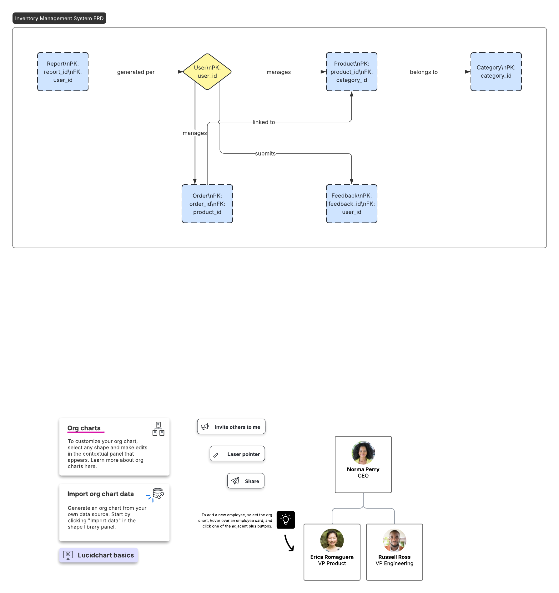
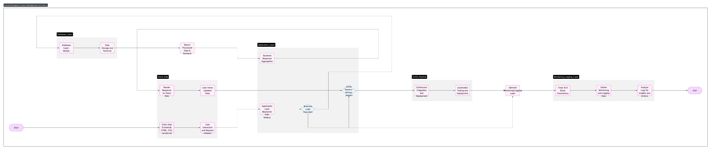
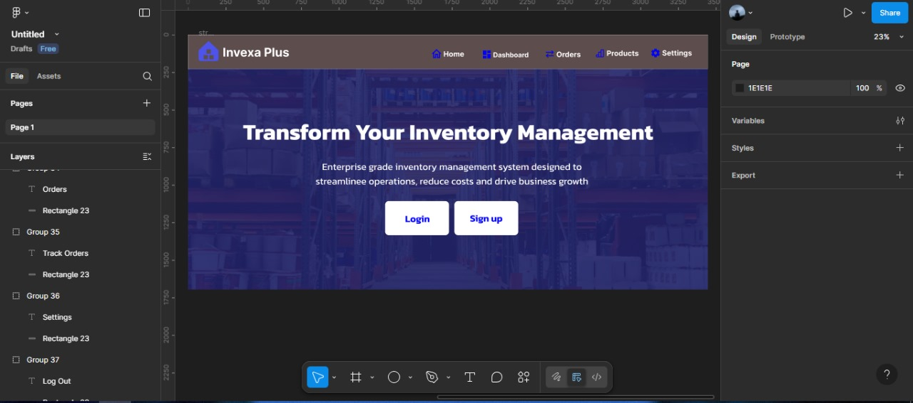

# 🎨 Design Document: Inventory Management System Using XAMPP Database

## 1. UI/UX Design Overview

The system is designed to be clean, intuitive, and mobile-responsive with a modern interface using HTML, CSS, and JavaScript.

### Main Pages:
- *Home Page (Dashboard)*:
  - Total stock value
  - Recent transactions
  - Low stock alerts
  - Inventory by category (summary cards)
  - Contact & Feedback forms

- *Products Page*:
  - Table displaying all products
  - CRUD operations: Add, Edit (inline), Delete
  - Categories filter and search bar

- *Orders Page*:
  - Order list with filter by date and status
  - Add/Delete order functionality
  - Stock update triggered on order placement

- *Reports Page*:
  - Bar chart: Sales trends over time
  - Pie chart: Inventory breakdown by category
  - Chart.js used for dynamic rendering

- *Settings Page*:
  - Toggle dark mode
  - Update user profile, change password
  - Notification preferences

- *Login/Signup Page*:
  - User authentication with validation
  - Error handling and session messages

---

## 2. Entity-Relationship Diagram (ERD)

The system includes the following main entities:

- *Users*
  - User_ID (PK)
  - Name
  - Email
  - Password (hashed)

- *Products*
  - Product_ID (PK)
  - Name
  - Quantity
  - Price
  - Category

- *Orders*
  - Order_ID (PK)
  - Product_ID (FK)
  - Quantity Ordered
  - Order Date

- *Categories*
  - Category_ID (PK)
  - Category Name

- *Feedback*
  - Feedback_ID (PK)
  - User_ID (FK)
  - Message
  - Date Submitted

- *Reports (virtual)*
  - Generated from product and order data using SQL aggregations.

Tools Used: [Lucidchart AI] for ERD creation.

---

## 3. System Architecture

This system follows a 3-tier architecture:

```plaintext
+-------------------+      +------------------+     +------------------+
|    Frontend       | ---> |     Backend      | --> |    Database      |
| HTML, CSS, JS     |      | PHP/Node.js      |     | MySQL (XAMPP)    |
+-------------------+      +------------------+     +------------------+
```
### 📷 Figure 3: ERD


### 📷 Figure 4: System Architecture


### 📷 Figure 5: Dashboard Wireframe

