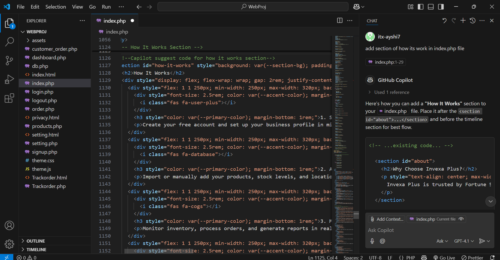
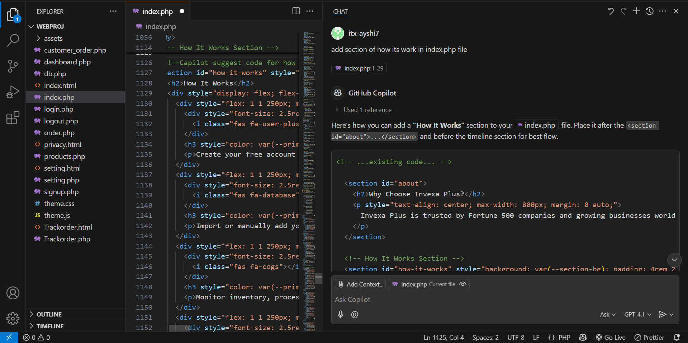

# 🛠 Development Document: Inventory Management System Using XAMPP Database

## 1. Overview

This document describes the development process, coding standards, AI integration, folder structure, and backend logic of the Inventory Management System. Development follows the SDLC process with AI tools supporting automation and efficiency.
## 🧠 AI Tool Used
- **GitHub Copilot**  
  GitHub Copilot was used as an AI coding assistant during implementation. It helped generate JavaScript logic for transactions, budget handling, user login/signup, and rendering financial reports with Chart.js.

---

## 2. Technology Stack

| Layer         | Technology                  |
|---------------|-----------------------------|
| Frontend      | HTML, CSS, JavaScript       |
| Backend       | PHP or Node.js              |
| Database      | MySQL (via XAMPP)           |
| Visualization | Chart.js                    |
| AI Tools      | GitHub Copilot, ChatGPT     |

---

## Screenshots

